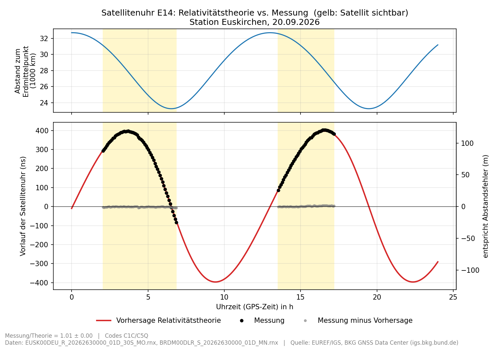
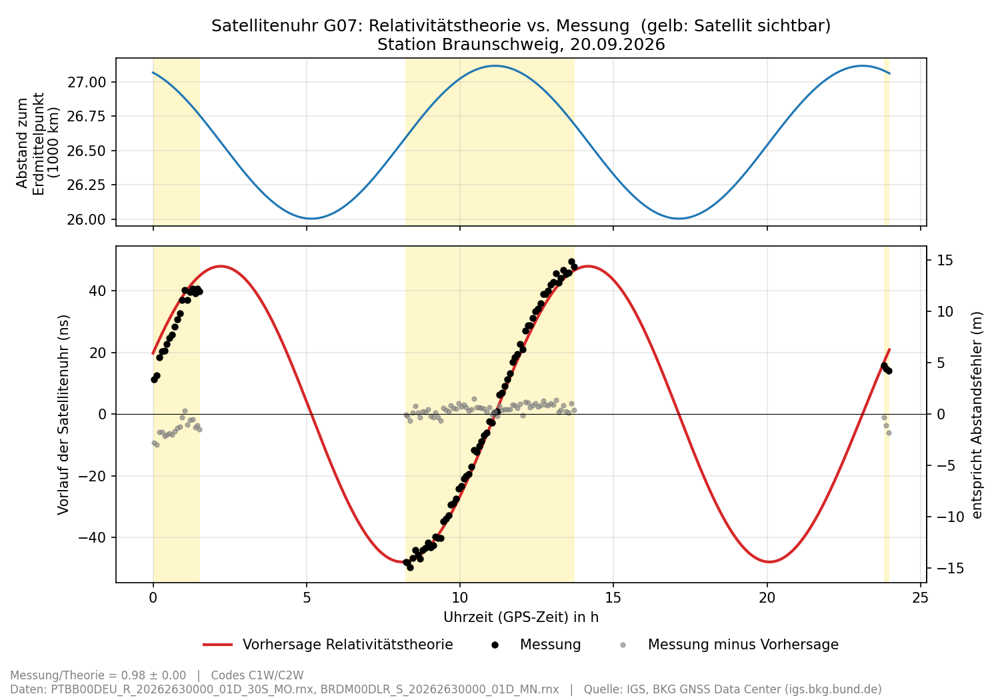

# Relativistische Zeitdilatation einer GNSS-Satellitenuhr – aus echten Rohdaten

Mit öffentlich verfügbaren Messdaten vom **20.09.2026** wird der periodische
Relativitätseffekt der Uhr des Galileo-Satelliten **E14** sichtbar gemacht.
Messung und Vorhersage der Relativitätstheorie stimmen auf rund 1 % überein:
**Messung/Theorie k = 1,01** bei einer Amplitude von **396 ns ≈ 119 m**.

Gedacht als Material für einen Physik-Grundkurs (Klasse 13, NRW).
Dazu gibt es ein [Arbeitsblatt für 45 Minuten](arbeitsblatt/arbeitsblatt.md) mit
[Lösungen](arbeitsblatt/loesung.md), zum Ausdrucken als [PDF](arbeitsblatt/arbeitsblatt.pdf).

---

## Ergebnis

### Galileo E14, gemessen in Euskirchen (Station EUSK)



| | |
|---|---|
| Satellit | E14 (GSAT0202), Exzentrizität e = 0,169 |
| Bahn | 23 260 km bis 32 700 km vom Erdmittelpunkt, Umlaufzeit 12,9 h |
| Messstation | EUSK, Euskirchen (NRW), Empfänger Septentrio PolaRx5E |
| Daten | 20.09.2026, alle 30 s; 1028 Messzeitpunkte über 10° Elevation |
| Vorhersage (Amplitude) | 396 ns, entspricht 119 m |
| **Messung/Theorie k** | **1,012** |
| Streuung nach Abzug der Theorie | 3,3 ns, entspricht 1 m |

**So liest man den Plot**

- **Oben:** Abstand des Satelliten zum Erdmittelpunkt. Die Bahn ist deutlich elliptisch.
- **Unten:** Vorlauf der Satellitenuhr gegenüber einer idealen Uhr.
  - rote Linie: Vorhersage der Relativitätstheorie
  - schwarze Punkte: Messung (5-Minuten-Mittelwerte)
  - graue Punkte: Messung minus Vorhersage, also der Rest, der nicht durch die Relativitätstheorie erklärt wird
- **Gelb:** Zeiten, in denen der Satellit von der Station aus sichtbar war (über 10° Elevation).
- **Rechte Achse:** derselbe Uhrfehler in Metern, siehe [unten](#was-heißt-entspricht-abstandsfehler).

### Zum Vergleich: GPS G07, gemessen in Braunschweig (Station PTBB)



G07 hat eine fast kreisförmige Bahn (e = 0,021). Der Effekt ist deshalb etwa
achtmal kleiner (48 ns ≈ 14 m), das Messrauschen fällt stärker auf.
Ergebnis: **k = 0,98**.

---

## Die Physik dahinter

Auf einer elliptischen Bahn ändern sich Geschwindigkeit und Höhe des Satelliten ständig:

- **Erdnah (Perigäum):** Der Satellit ist schnell und tief im Schwerefeld, seine Uhr geht langsamer.
- **Erdfern (Apogäum):** Der Satellit ist langsam und hoch, seine Uhr geht schneller.

Über einen Umlauf summiert sich das zu einer periodischen Gangabweichung:

```
Δt_rel = −2·√μ / c² · e · √A · sin E
```

Dabei ist μ = G·M_Erde, e die Exzentrizität, A die große Halbachse und E die
exzentrische Anomalie (der Bahnwinkel). Bei E14 sind das ±396 ns pro Umlauf.

**Bemerkenswert:** Spezielle Relativitätstheorie (Geschwindigkeit) und Allgemeine
Relativitätstheorie (Gravitation) tragen *genau je zur Hälfte* zu diesem
periodischen Anteil bei. Das folgt aus dem Energiesatz der Bahn (Vis-viva-Gleichung
v² = μ·(2/r − 1/a)): Die Ganganteile −v²/(2c²) und −μ/(r·c²) schwanken beide um
−μ/c²·(1/r − 1/a).

Der **konstante** Anteil der Zeitdilatation (bei GPS rund 38 µs pro Tag) ist im
Plot nicht zu sehen. Er steckt in den Uhrparametern der Navigationsnachricht,
und die werden in der Auswertung abgezogen.

**Hintergrund:** E14 und E18 sind beim Start am 22.08.2014 versehentlich auf
elliptischen Bahnen gelandet. Genau diese beiden Satelliten wurden 2018 für einen
der bisher genauesten Tests der gravitativen Rotverschiebung genutzt (GREAT-Experiment,
siehe [Quellen](#quellen)). Die Auswertung hier ist eine stark vereinfachte
Schulversion desselben Effekts.

### Was heißt „entspricht Abstandsfehler“?

Ein GNSS-Empfänger misst Abstände über Laufzeiten: Abstand = c · Laufzeit. Den
Sendezeitpunkt liest er aus dem Zeitstempel der Satellitenuhr. Geht diese um Δt
vor, ist die berechnete Laufzeit um Δt zu kurz und der Satellit erscheint um
c · Δt zu nah.

**1 ns entspricht 30 cm.** Ohne Relativitätskorrektur würde sich ein Empfänger bei
E14 um bis zu ±119 m beim Abstand verrechnen. Deshalb wendet jeder Empfänger die
Formel oben an. Die grauen Punkte zeigen, was danach übrig bleibt: etwa 1 m, die
normale Messungenauigkeit.

---

## Messprinzip

Alles steckt im Skript `gnss_relativitaet.py`. Es braucht nur numpy und matplotlib
und kommt ohne externe GNSS-Software aus.

1. **Pseudostrecken** (gemessene Abstände) auf zwei Frequenzen einlesen: bei Galileo E1/E5a,
   bei GPS L1/L2. Aus ihnen eine Kombination bilden, in der der Einfluss der Ionosphäre herausfällt.
2. **Satellitenposition und -uhr** aus den Broadcast-Bahndaten berechnen, nach den
   Formeln der offiziellen Schnittstellendokumente (ICD).
3. **Station:** feste Koordinate aus dem Dateikopf, einfaches Troposphärenmodell.
4. **Empfängeruhr** für jeden Messzeitpunkt bestimmen: Median über alle *anderen*
   Satelliten desselben Systems, jeweils mit Relativitätskorrektur.
5. **Zielsatellit:** Das Residuum *ohne* Relativitätskorrektur ergibt den gemessenen
   Uhrfehler. Er wird mit der Vorhersage verglichen, angepasst wird
   Messung = k · Theorie + Konstante.

---

## Was war das Problem?

Der erste Versuch mit den Daten aus Braunschweig (PTBB) brach mit
„Zu wenige gueltige Epochen fuer E14 (0)“ ab.

**Ursache:** Die Beobachtungsdatei von PTBB enthält an diesem Tag keine einzige
Messung von E14, und auch keine von E18. Am Skript lag es nicht.

- E14 und E18 sind laut Galileo-Betreiber seit Februar 2021 offiziell
  „nicht nutzbar“ (Meldung NAGU 2021008). In der Navigationsnachricht sind sie als
  „Signal außer Betrieb“ markiert, an jedem geprüften Tag des Jahres 2026.
- Die Satelliten senden trotzdem weiter, und ihre Bahn- und Uhrdaten werden weiter
  aktualisiert. Ob eine Station sie aufzeichnet, hängt von der Empfängereinstellung ab.
- Die übrigen Verdachtspunkte haben sich als unbegründet erwiesen:
  - Die Auswahl der Bahndaten (F/NAV) ist richtig.
  - Die Zeitzuordnung der Bahndaten (toe/toc) stimmt.
  - Die Gesundheitsprüfung ist nicht zu streng.

**Lösung:** Von 33 geprüften deutschen IGS- und EUREF-Stationen haben 27 E14 den
ganzen Tag aufgezeichnet. Sechs haben ihn nicht oder nur vereinzelt erfasst:
PTBB, WTZA, HOBU, WTZR, BADH und WRLG. Gewählt wurde **EUSK in Euskirchen**. Sie
liegt in NRW und liefert genau die Signalcodes, auf die das Skript ausgelegt ist
(C1C/C5Q).

---

## Plausibilitätsprüfung

**Andere Satelliten:** Nach Abzug der Empfängeruhr bleiben Residuen im Meterbereich,
wie bei Code-Messungen zu erwarten.

| Station | System | RMS |
|---|---|---|
| EUSK | Galileo | 0,80 m |
| PTBB | Galileo | 0,74 m |
| PTBB | GPS | 1,04 m |

**E14 an neun Stationen** mit verschiedenen Empfängern:

| Station | Ort | Empfänger | k | Streuung |
|---|---|---|---|---|
| EUSK | Euskirchen | Septentrio | 1,012 | 3,3 ns |
| WTZS | Wettzell | Septentrio | 1,004 | 2,5 ns |
| OBE4 | Oberpfaffenhofen | Septentrio | 1,003 | 2,2 ns |
| KARL | Karlsruhe | Javad | 1,002 | 4,5 ns |
| HELG | Helgoland | Javad | 1,002 | 3,0 ns |
| BORJ | Borkum | Javad | 1,001 | 2,9 ns |
| FFMJ | Frankfurt/Main | Javad | 1,000 | 2,8 ns |
| GOET | Göttingen | Javad | 1,000 | 3,1 ns |
| POTS | Potsdam | Javad | 0,998 | 3,2 ns |
| **Mittel** | | | **1,002 ± 0,004** | |

Nachrechnen lässt sich die Tabelle mit dem Hauptskript (Satellit E14). Die Daten der
anderen Stationen liegen nicht im Repository, sondern unter
`https://igs.bkg.bund.de/root_ftp/IGS/obs/2026/263/` (OBE4, FFMJ, POTS) bzw.
`https://igs.bkg.bund.de/root_ftp/EUREF/obs/2026/263/` (WTZS, KARL, HELG, BORJ, GOET).

**GPS:** Bei zwölf GPS-Satelliten mit Amplituden von 20 bis 48 ns (Station PTBB)
ergibt sich k = 0,97 ± 0,04. Weil der Effekt kleiner ist, fallen Ungenauigkeiten der
Broadcast-Bahndaten (rund 0,5 m) stärker ins Gewicht.

Die Residuen der anderen Satelliten (erste Tabelle) und die GPS-Statistik stammen aus
zusätzlichen Prüfrechnungen, die nicht im Repository liegen.

**Zur Fehlerangabe im Plot:** Die Angabe „± 0,00“ ist die rein formale Unsicherheit.
Sie unterstellt unabhängige Messpunkte. Tatsächlich hängen die Fehler zeitlich
zusammen, etwa durch Signalreflexionen an der Station und durch Bahnfehler.
Realistisch ist **k = 1,00 ± 0,01** für E14 und **k = 0,98 ± 0,04** für G07.

---

## Reproduzieren

Benötigt Python 3 mit numpy und matplotlib, zum Entpacken zusätzlich das Paket
`hatanaka`. Die getesteten Versionen stehen in `requirements.txt`.

```bash
pip install -r requirements.txt

# Beobachtungsdateien entpacken (Hatanaka-Kompression), erzeugt die *_MO.rnx
python -c "import hatanaka; hatanaka.decompress_on_disk('EUSK00DEU_R_20262630000_01D_30S_MO.crx.gz')"
python -c "import hatanaka; hatanaka.decompress_on_disk('PTBB00DEU_R_20262630000_01D_30S_MO.crx.gz')"

# Plot E14 / Euskirchen
python gnss_relativitaet.py EUSK00DEU_R_20262630000_01D_30S_MO.rnx BRDM00DLR_S_20262630000_01D_MN.rnx E14 \
       --out relativitaet_E14_EUSK.png --station Euskirchen \
       --quelle "EUREF/IGS, BKG GNSS Data Center (igs.bkg.bund.de)"

# Plot G07 / Braunschweig
python gnss_relativitaet.py PTBB00DEU_R_20262630000_01D_30S_MO.rnx BRDM00DLR_S_20262630000_01D_MN.rnx G07 \
       --out relativitaet_G07.png --station Braunschweig \
       --quelle "IGS, BKG GNSS Data Center (igs.bkg.bund.de)"
```

Weitere Optionen:
- `--mask`: Elevationsmaske in Grad (Standard 10)
- `--bin`: Mittelung in Minuten (Standard 5)
- `--xyz`: Stationskoordinate
- `--station`: Name im Plottitel; ohne Angabe das Kürzel aus der Datei
- `--quelle`: Quellenangabe in der Fußzeile

Eine Übersicht zeigt `python gnss_relativitaet.py -h`.

---

## Dateien

| Datei | Inhalt |
|---|---|
| `README.md` | diese Beschreibung |
| `gnss_relativitaet.py` | Auswerteskript |
| `requirements.txt` | benötigte Python-Pakete (getestete Versionen) |
| `.gitignore` | hält die großen entpackten Dateien aus dem Repository heraus |
| `arbeitsblatt/` | Arbeitsblatt (45 min) mit Lösungen, Vorlage und Abbildungsskript |
| `relativitaet_E14_EUSK.png` | Ergebnis E14, Station Euskirchen |
| `relativitaet_G07.png` | Ergebnis G07, Station Braunschweig |
| `EUSK00DEU_R_20262630000_01D_30S_MO.crx.gz` | Beobachtungen Euskirchen (EUREF), gepackt |
| `PTBB00DEU_R_20262630000_01D_30S_MO.crx.gz` | Beobachtungen Braunschweig (IGS), gepackt |
| `BRDM00DLR_S_20262630000_01D_MN.rnx` | Broadcast-Bahndaten aller Systeme (zusammengeführt vom DLR) |

Die entpackten Beobachtungsdateien (`*_MO.rnx`, 37–49 MB) sind nicht im Repository.
Sie entstehen beim Entpacken, siehe [Reproduzieren](#reproduzieren).

**Download-Adressen** (alle frei zugänglich, ohne Anmeldung):

- https://igs.bkg.bund.de/root_ftp/EUREF/obs/2026/263/EUSK00DEU_R_20262630000_01D_30S_MO.crx.gz
- https://igs.bkg.bund.de/root_ftp/IGS/obs/2026/263/PTBB00DEU_R_20262630000_01D_30S_MO.crx.gz
- https://igs.bkg.bund.de/root_ftp/IGS/BRDC/2026/263/BRDM00DLR_S_20262630000_01D_MN.rnx.gz

Die Zahl 263 im Pfad ist der Tag im Jahr; der 20.09.2026 ist Tag 263.

---

## Quellen

- Daten: [BKG GNSS Data Center](https://igs.bkg.bund.de/), Netze IGS und EUREF;
  Broadcast-Bahndaten zusammengeführt von DLR/GSOC
- Status von E14/E18: [European GNSS Service Centre – Constellation Information](https://www.gsc-europa.eu/system-service-status/constellation-information)
  (NAGU 2021008 „GSAT0201 and GSAT0202 unavailable“)
- GREAT-Experiment:
  - P. Delva et al., *Gravitational Redshift Test Using Eccentric Galileo Satellites*,
    [Phys. Rev. Lett. 121, 231101 (2018)](https://link.aps.org/doi/10.1103/PhysRevLett.121.231101)
  - S. Herrmann et al., *Test of the Gravitational Redshift with Galileo Satellites in an Eccentric Orbit*,
    [Phys. Rev. Lett. 121, 231102 (2018)](https://link.aps.org/doi/10.1103/PhysRevLett.121.231102)
