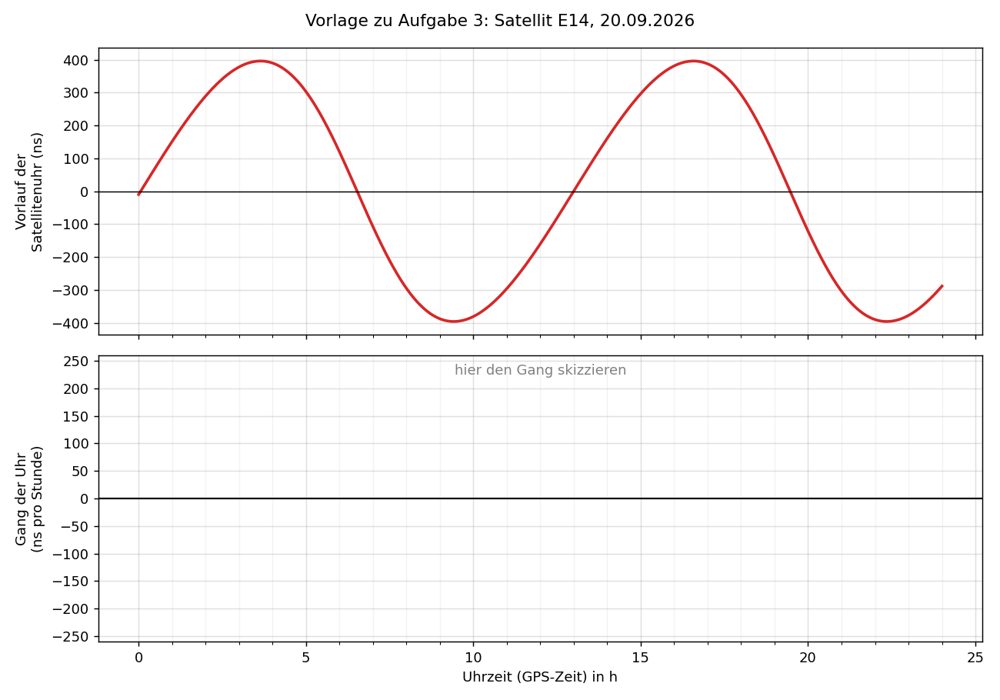

# Arbeitsblatt: Wie Relativitätstheorie eine Satellitenuhr verstellt

**Physik, Klasse 13 · Bearbeitungszeit 45 Minuten · Partnerarbeit**

**Vorwissen:** Zeitdilatation durch Geschwindigkeit (SRT) und durch Gravitation (ART)

**Ziel:** Am Ende kannst du den Plot unten vollständig erklären. Dazu gehört auch, *warum* die
Kurve ihr Maximum dort hat, wo sie es hat.

**M1 Der Plot.** Der Galileo-Satellit E14 trägt eine Atomuhr. Seine Bahn ist versehentlich
elliptisch geworden. Eine Bodenstation in Euskirchen (NRW) hat am 20.09.2026 alle 30 Sekunden
die Signale von E14 aufgezeichnet. Daraus lässt sich ablesen, wie weit die Satellitenuhr
gegenüber einer idealen Uhr *vorgeht*.

---

## Formelkasten

Für eine Uhr, die sich mit der Geschwindigkeit v bewegt (v ≪ c) und den Abstand r vom
Erdmittelpunkt hat, gilt gegenüber einer weit entfernten, ruhenden Uhr:

| Effekt | relative Gangänderung Δτ/τ | Bedeutung |
|---|---|---|
| Geschwindigkeit (SRT) | −v² / (2c²) | je schneller, desto langsamer geht die Uhr |
| Gravitation (ART) | −G·M / (r·c²) | je näher an der Erde, desto langsamer geht die Uhr |

Konstanten: G·M_Erde = 3,986 · 10¹⁴ m³/s², c = 3,00 · 10⁸ m/s

**Gang** = um wie viel die Uhr pro Stunde gewinnt oder verliert (in ns pro Stunde). 
**Vorlauf** = um wie viel die Uhr insgesamt vorgeht (in ns). Der Vorlauf ist der *aufsummierte* Gang.

---

## Aufgabe 1: Die Bahn (ca. 7 min)

Benutze das **obere** Diagramm.

a) Lies den kleinsten und den größten Abstand zum Erdmittelpunkt ab.

   r_min = ______________ km  (Perigäum, erdnächster Punkt)
   r_max = ______________ km  (Apogäum, erdfernster Punkt)

b) Lies die Uhrzeiten ab, zu denen E14 im Perigäum und im Apogäum ist, und bestimme die Umlaufzeit T.

   Perigäum: __________ h und __________ h  Apogäum: __________ h und __________ h  T ≈ __________ h

c) Im Perigäum ist E14 v_P = 4,48 km/s schnell. Begründe mit dem 2. Keplerschen Gesetz, dass er im
   Apogäum langsamer ist. *Zusatz:* Berechne v_A mit r_P · v_P = r_A · v_A.

---

## Aufgabe 2: Wie schnell geht die Uhr? (ca. 10 min)

Die Tabelle enthält zusätzlich die „mittlere Bahn“ (r = 27 980 km, v = 3,77 km/s). Um diesen
Mittelwert schwankt der Gang der Uhr.

a) Berechne die fehlenden Werte. Hinweis: Rechne mit Zehnerpotenzen und runde auf drei Stellen.

| Bahnpunkt | r in km | v in km/s | SRT: −v²/(2c²) | ART: −GM/(r·c²) | Summe |
|---|---|---|---|---|---|
| Perigäum | 23 260 | 4,48 | | | |
| mittlere Bahn | 27 980 | 3,77 | −0,790 · 10⁻¹⁰ | −1,583 · 10⁻¹⁰ | −2,372 · 10⁻¹⁰ |
| Apogäum | 32 700 | 3,18 | | | |

b) Berechne jeweils die Abweichung vom Wert der mittleren Bahn, getrennt für SRT und ART.
   Was fällt dir auf?

| | Abweichung SRT | Abweichung ART | Abweichung gesamt | in ns pro Stunde |
|---|---|---|---|---|
| Perigäum | | | | |
| Apogäum | | | | |

   Tipp: Abweichung · 3600 s · 10⁹ ns/s ergibt ns pro Stunde.

c) Ergänze den Satz: Im Perigäum geht die Satellitenuhr ______________ als im Mittel,
   weil der Satellit dort ______________ ist **und** ______________ im Schwerefeld der Erde steckt.
   Beide Effekte wirken in ______________ Richtung.

---

## Aufgabe 3: Vom Gang zum Vorlauf – die Kernaufgabe (ca. 15 min)

**Vergleich mit einem Konto:** Der Gang ist wie Einnahmen oder Ausgaben pro Stunde, der Vorlauf
wie der Kontostand. Der Kontostand steigt, solange Geld hereinkommt. Er ist dann am höchsten,
wenn die Einnahmen gerade in Ausgaben umschlagen.

Benutze das **untere** Diagramm (rote Linie) und die *Vorlage zu Aufgabe 3*.

a) Markiere in der Vorlage mit senkrechten Linien die Zeitpunkte von Perigäum und Apogäum
   aus Aufgabe 1b.

b) Wann wächst der Vorlauf am schnellsten, wann nimmt er am schnellsten ab? Vergleiche mit
   deinen Markierungen und mit Aufgabe 2.

c) Der Vorlauf ist bei etwa 3,6 h maximal, also **nicht** im Apogäum. Erkläre mit dem
   Konto-Vergleich, warum das so sein muss. Wie groß ist der Gang in diesem Moment?

d) Skizziere in der Vorlage den Gang der Uhr. Nutze: Der Gang ist die *Steigung* des Vorlaufs.
   Trage die Extremwerte aus Aufgabe 2b ein.

e) Abschätzung: Zwischen zwei Nulldurchgängen des Gangs (ca. 6,5 h) geht die Uhr im Mittel
   etwa 125 ns pro Stunde falsch. Schätze ab, um wie viel sich der Vorlauf in dieser Zeit
   ändert, und vergleiche mit dem Plot.

---

## Aufgabe 4: Messung gegen Theorie (ca. 8 min)

a) Was bedeuten die **schwarzen Punkte**, die **rote Linie** und die **gelben Bereiche**?
   Warum gibt es nicht den ganzen Tag Messpunkte?

b) Die **grauen Punkte** sind „Messung minus Vorhersage“. Was würde man sehen, wenn die
   Relativitätstheorie falsch wäre?

c) Das Verhältnis Messung/Theorie ist k = 1,01. Formuliere das Ergebnis in einem Satz.

d) **Rechte Achse:** Ein Empfänger berechnet den Abstand zum Satelliten mit Abstand = c · Laufzeit.
   Zeige: 1 ns Uhrfehler entspricht 30 cm. Wie groß wäre der Fehler beim Abstand ohne
   Relativitätskorrektur höchstens?

---

## Zusatzaufgaben

**Z1** Die Bodenuhr steht bei r = 6371 km und bewegt sich mit der Erdrotation (ca. 0,46 km/s).
Berechne ihren Gang wie in Aufgabe 2 und vergleiche mit der mittleren Bahn von E14.
Um wie viele Mikrosekunden pro Tag geht die Satellitenuhr im Mittel vor? Warum sieht man diesen
konstanten Anteil im Plot nicht?

**Z2** Im README ist auch der GPS-Satellit G07 gezeigt. Seine Bahn ist fast kreisförmig.
Erkläre, warum der periodische Effekt dort rund achtmal kleiner ist.

---

## Merksatz

Fülle die Lücken am Ende der Stunde.

> Auf der elliptischen Bahn ist E14 im Perigäum ______________ und ______________,
> seine Uhr geht dort ______________. Im Apogäum ist es umgekehrt. SRT und ART tragen zu dieser
> Schwankung ______________ bei. Der Plot zeigt den ______________ Gang, also den Vorlauf.
> Er ist deshalb am größten, wenn ______________. Die Messung bestätigt die Vorhersage auf etwa
> ______ %.
