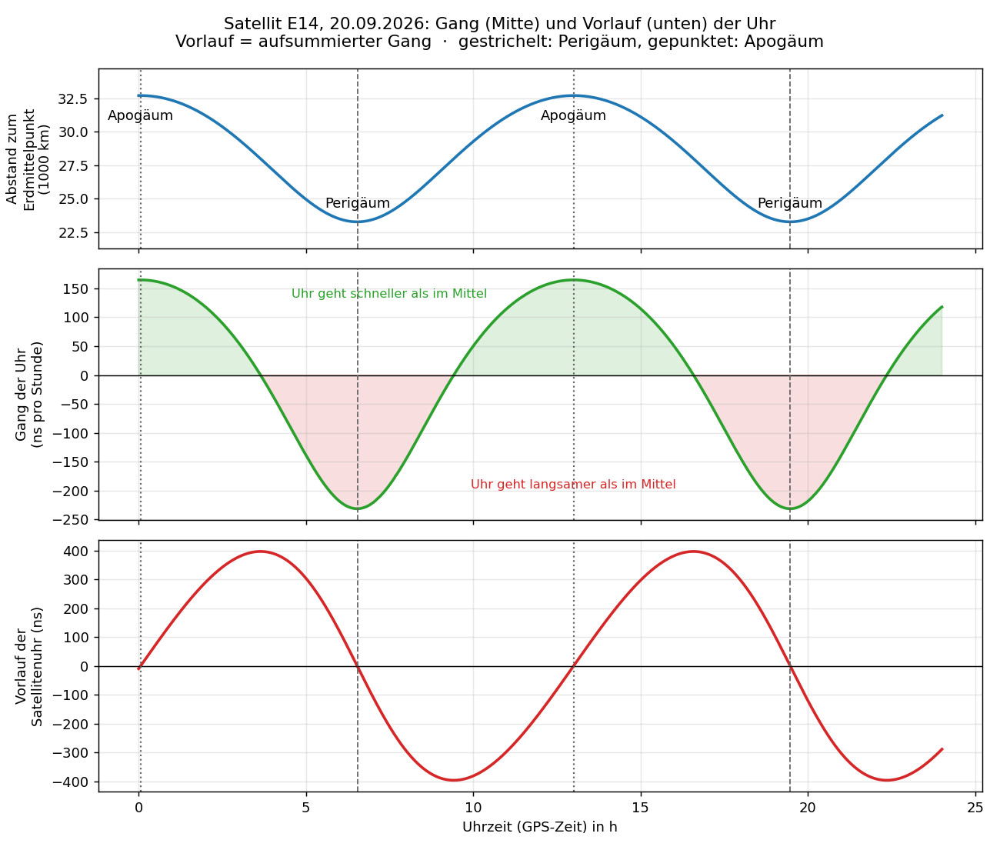

# Lösungen und Hinweise für die Lehrkraft

Zum [Arbeitsblatt](arbeitsblatt.md) „Wie Relativitätstheorie eine Satellitenuhr verstellt“.

## Stundenverlauf (45 min)

| Zeit | Phase | Inhalt |
|---|---|---|
| 0–5 | Einstieg | Plot zeigen (Beamer). Frage: „Geht die Uhr im Satelliten schneller oder langsamer als bei uns?“ Vermutungen sammeln: SRT sagt „langsamer“, ART sagt „schneller“. Formelkasten kurz besprechen. |
| 5–12 | Aufgabe 1 | Bahn ablesen |
| 12–22 | Aufgabe 2 | Gang rechnen, Entdeckung „SRT und ART je zur Hälfte“ |
| 22–37 | Aufgabe 3 | **Kern:** Unterschied Gang und Vorlauf. Zwischensicherung bei 3c im Plenum. |
| 37–43 | Aufgabe 4 | Messung, Residuen, Meter-Achse |
| 43–45 | Sicherung | Merksatz |

Schnelle Gruppen bearbeiten Z1/Z2. Wenn die Zeit knapp wird, kann 1c oder 2b (Spalte SRT/ART
getrennt) entfallen. Die Aussage „je zur Hälfte“ sollte aber im Plenum fallen.

**Typische Fehlvorstellung:** Viele lesen die rote Kurve als *Gang*, also: „Bei 3,6 h geht die Uhr
am schnellsten.“ Tatsächlich zeigt der Plot den *Vorlauf* (aufsummierter Gang). Die Uhr geht im
Apogäum am schnellsten, dort steigt der Vorlauf am steilsten an. Aufgabe 3 zielt genau darauf.

---

## Aufgabe 1

a) r_min ≈ 23 300 km, r_max ≈ 32 700 km (Werte laut README: 23 260 km und 32 700 km).

b) Perigäum ≈ 6,5 h und 19,5 h, Apogäum ≈ 0 h und 13,0 h, T ≈ 13,0 h (genau: 12,9 h).

c) Der Fahrstrahl überstreicht in gleichen Zeiten gleiche Flächen. Bei großem Abstand muss der
   Satellit deshalb langsamer sein. v_A = 23 260 · 4,48 / 32 700 km/s ≈ 3,19 km/s.

## Aufgabe 2

a) (mit c = 3,00 · 10⁸ m/s)

| Bahnpunkt | SRT | ART | Summe |
|---|---|---|---|
| Perigäum | −1,115 · 10⁻¹⁰ | −1,904 · 10⁻¹⁰ | −3,019 · 10⁻¹⁰ |
| mittlere Bahn | −0,790 · 10⁻¹⁰ | −1,583 · 10⁻¹⁰ | −2,372 · 10⁻¹⁰ |
| Apogäum | −0,562 · 10⁻¹⁰ | −1,354 · 10⁻¹⁰ | −1,916 · 10⁻¹⁰ |

b)

| | Abweichung SRT | Abweichung ART | gesamt | ns pro Stunde |
|---|---|---|---|---|
| Perigäum | −0,325 · 10⁻¹⁰ | −0,321 · 10⁻¹⁰ | −0,647 · 10⁻¹⁰ | ≈ −233 |
| Apogäum | +0,228 · 10⁻¹⁰ | +0,228 · 10⁻¹⁰ | +0,456 · 10⁻¹⁰ | ≈ +164 |

**Auffällig:** SRT und ART liefern (bis auf Rundung) *gleich große* Schwankungen. Absolut ist der
ART-Anteil etwa doppelt so groß, aber bei den Abweichungen vom Mittelwert tragen beide genau die
Hälfte bei. Grund ist der Energiesatz der Bahn (Vis-viva-Gleichung, siehe README). Für den
Grundkurs reicht: Wo der Satellit tief ist, ist er auch schnell. Beide Effekte bremsen dann die
Uhr gleichermaßen.

c) … langsamer …, schnell … tief …, gleicher Richtung.

## Aufgabe 3



a) Perigäum-Linien bei 6,5 h und 19,5 h, Apogäum-Linien bei 0 h und 13,0 h.

b) Am schnellsten wächst der Vorlauf im **Apogäum** (0 h, 13 h): steilster Anstieg. Am schnellsten
   nimmt er im **Perigäum** ab (6,5 h, 19,5 h): steilster Abfall. Das passt zu Aufgabe 2: Im
   Apogäum ist der Gang am größten (+164 ns/h), im Perigäum am kleinsten (−233 ns/h).
   Der Vorlauf ist in Apogäum und Perigäum jeweils null. Das liegt daran, wie der konstante Anteil
   abgezogen wird.

c) Nach dem Apogäum geht die Uhr immer noch schneller als im Mittel. Der Vorlauf wächst also weiter,
   nur langsamer. Erst wenn der Satellit den mittleren Abstand r ≈ a erreicht (bei ca. 3,6 h), ist
   der Gang null. Ab dann geht die Uhr langsamer als im Mittel und der Vorlauf nimmt ab. Im
   Maximum ist der Gang also **null**, wie beim Kontostand: Er ist am höchsten, wenn die Einnahmen
   gerade in Ausgaben umschlagen.

d) Siehe mittleres Diagramm oben. Maxima ≈ +164 ns/h bei 0 h und 13 h, Minima ≈ −233 ns/h bei
   6,5 h und 19,5 h. Nullstellen bei den Extremstellen des Vorlaufs (≈ 3,6 h, 9,4 h, 16,6 h, 22,4 h).
   Das Minimum ist tiefer und schmaler als das Maximum, weil der Satellit im Perigäum schnell
   vorbeifliegt (Kepler 2).
   Mathematisch: Gang = Ableitung des Vorlaufs, Vorlauf = Integral über den Gang.

e) 125 ns/h · 6,5 h ≈ 810 ns. Im Plot geht der Vorlauf von −396 ns auf +396 ns, also um 792 ns.
   Die Abschätzung passt gut.

## Aufgabe 4

a) Schwarze Punkte: gemessener Vorlauf (5-Minuten-Mittel). Rote Linie: Vorhersage der
   Relativitätstheorie. Gelb: E14 steht von Euskirchen aus mehr als 10° über dem Horizont. Sonst
   ist er hinter dem Horizont bzw. zu tief, und es gibt keine Messung.

b) Die grauen Punkte liegen auf null, mit etwa 3 ns Streuung (≈ 1 m). Wäre die Theorie falsch,
   hätten sie selbst eine Sinusform, z. B. ±400 ns ohne Relativität oder ±200 ns, wenn nur SRT
   oder nur ART stimmen würde.

c) Die gemessene Schwankung der Satellitenuhr stimmt mit der Vorhersage der Relativitätstheorie
   auf etwa 1 % überein (realistisch k = 1,00 ± 0,01).

d) c · 1 ns = 3 · 10⁸ m/s · 10⁻⁹ s = 0,3 m. Ohne Korrektur: 396 ns · 0,3 m/ns ≈ 119 m.

## Zusatzaufgaben

**Z1** Boden: SRT ≈ −0,012 · 10⁻¹⁰, ART ≈ −6,952 · 10⁻¹⁰, Summe ≈ −6,963 · 10⁻¹⁰.
Differenz zur mittleren Bahn: +4,59 · 10⁻¹⁰. Mal 86 400 s ergibt ≈ +40 µs pro Tag. Die
Satellitenuhr geht also vor. Hier überwiegt die ART deutlich (GPS: ca. 38 µs/Tag). Im Plot sieht
man diesen Anteil nicht: Er ist konstant und wird über die Uhrparameter der Navigationsnachricht
abgezogen. Bei GPS wird zusätzlich die Frequenz der Satellitenuhren schon vor dem Start
passend verstellt. Ohne Korrektur wären es ca. 12 km Abstandsfehler pro Tag.

**Z2** Die Schwankung entsteht nur, weil sich r und v während eines Umlaufs ändern. Bei einer
Kreisbahn sind beide konstant. Die Amplitude ist proportional zur Exzentrizität:
0,169 / 0,021 ≈ 8 (Formel im README: Δt_rel ∝ e · √A).

## Merksatz (Lösung)

> Auf der elliptischen Bahn ist E14 im Perigäum **schnell** und **tief im Schwerefeld**,
> seine Uhr geht dort **langsamer**. Im Apogäum ist es umgekehrt. SRT und ART tragen zu dieser
> Schwankung **je zur Hälfte** bei. Der Plot zeigt den **aufsummierten** Gang, also den Vorlauf.
> Er ist deshalb am größten, wenn **der Gang gerade von „schneller“ zu „langsamer“ wechselt
> (bei mittlerem Abstand)**. Die Messung bestätigt die Vorhersage auf etwa **1** %.

---

## Material

| Datei | Inhalt |
|---|---|
| `arbeitsblatt.md` | Arbeitsblatt für die Schülerinnen und Schüler |
| `loesung.md` | diese Lösungen |
| `vorlage_aufgabe3.png` | Vorlage zu Aufgabe 3 (zum Ausdrucken) |
| `abb_gang_vorlauf.png` | Lösungsabbildung: Abstand, Gang und Vorlauf |
| `abb_gang_vorlauf.py` | erzeugt beide Abbildungen aus den Bahndaten im Repository |
| `arbeitsblatt.pdf`, `loesung.pdf` | Druckfassungen (Arbeitsblatt mit Schreiblinien) |
| `pdf_erzeugen.py` | erzeugt die PDFs aus den Markdown-Dateien (braucht `markdown` und Chromium) |

Abbildungen und PDFs neu erzeugen (im Hauptverzeichnis):

```bash
python arbeitsblatt/abb_gang_vorlauf.py
pip install markdown
python arbeitsblatt/pdf_erzeugen.py
```
